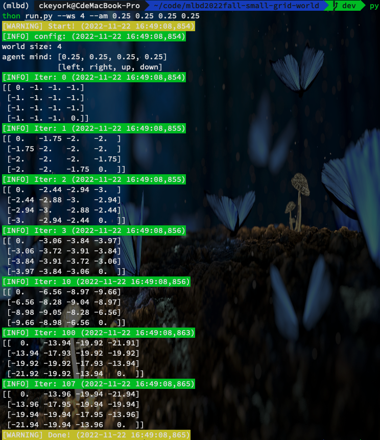
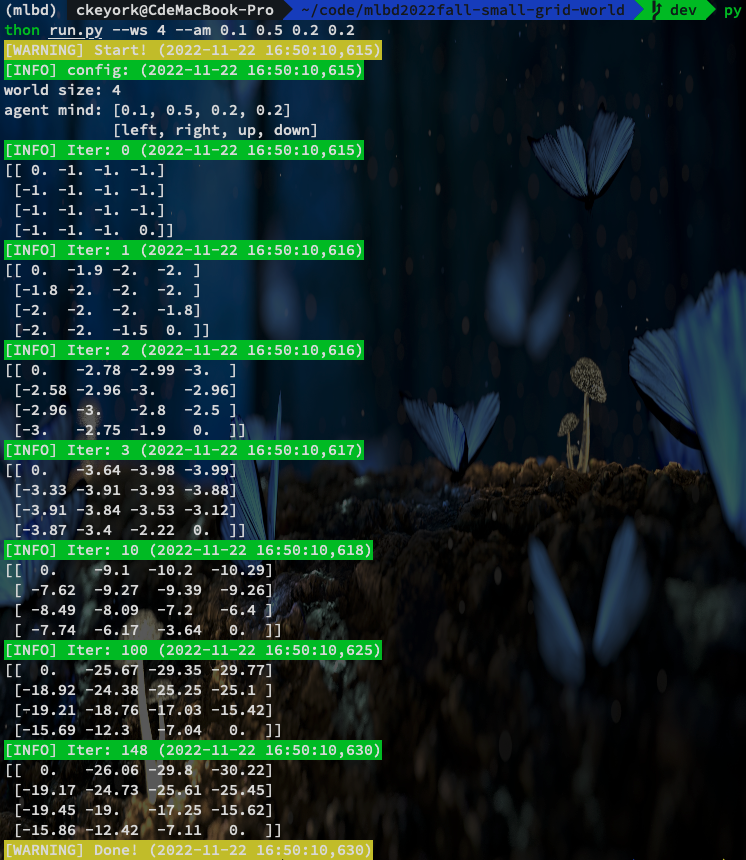
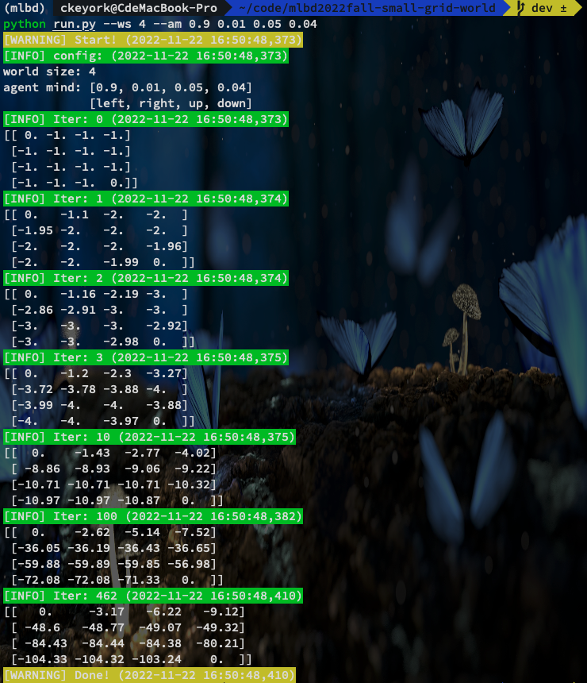
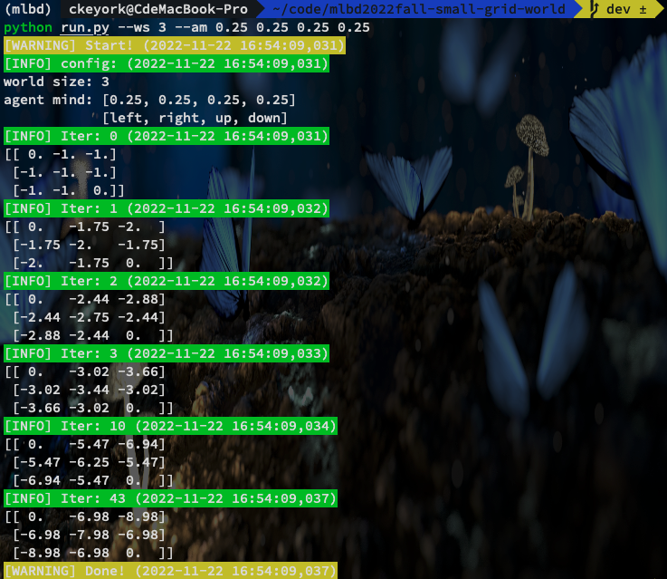
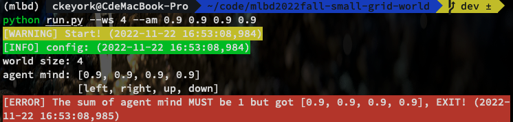

# mlbd2022fall-small-grid-world

2022 机器学习与大数据作业 9, code here: https://github.com/keyork/mlbd2022fall-small-grid-world

## Envs

```
python==3.7.13
numpy==1.21.6
colorlog==6.7.0
```

## Usage

```shell
git clone git@github.com:keyork/mlbd2022fall-small-grid-world.git
cd mlbd2022fall-small-grid-world
python run.py --ws 4 --am 0.25 0.25 0.25 0.25

usage: run.py [-h] [--ws WS] [--am AM [AM ...]]

optional arguments:
  -h, --help        show this help message and exit
  --ws WS           world size
  --am AM [AM ...]  agent mind, [left, right, up, down]
```

## Result

set `agent mind` = $[p_{left}, p_{right}, p_{up}, p_{down}]$

- `agent mind = [0.25, 0.25, 0.25, 0.25]`

  - `iter times`: 107

  - Result:

    ```python
    [[  0.   -13.96 -19.94 -21.94]
     [-13.96 -17.95 -19.94 -19.94]
     [-19.94 -19.94 -17.95 -13.96]
     [-21.94 -19.94 -13.96   0.  ]]
    ```

- `agent mind = [0.1, 0.5, 0.2, 0.2]`

  - `iter times`: 148

  - Result:

    ```python
    [[  0.   -26.06 -29.8  -30.22]
     [-19.17 -24.73 -25.61 -25.45]
     [-19.45 -19.   -17.25 -15.62]
     [-15.86 -12.42  -7.11   0.  ]]
    ```

- `agent mind = [0.9, 0.01, 0.05, 0.04]`

  - `iter times`: 462

  - Result:

    ```python
    [[   0.     -3.17   -6.22   -9.12]
     [ -48.6   -48.77  -49.07  -49.32]
     [ -84.43  -84.44  -84.38  -80.21]
     [-104.33 -104.32 -103.24    0.  ]]
    ```

## Change World Size

set `agent mind` = $[p_{left}, p_{right}, p_{up}, p_{down}]$ = `[0.25, 0.25, 0.25, 0.25] `

- `world size = 3`

  - `iter times`: 43

  - Result:

    ```python
    [[ 0.   -6.98 -8.98]
     [-6.98 -7.98 -6.98]
     [-8.98 -6.98  0.  ]]
    ```

- `world size = 5`

  - `iter times`: 213

  - Result:

    ```python
    [[  0.   -22.95 -34.25 -39.57 -41.56]
     [-22.95 -30.6  -36.25 -38.91 -39.57]
     [-34.26 -36.25 -37.25 -36.25 -34.25]
     [-39.57 -38.91 -36.25 -30.6  -22.95]
     [-41.56 -39.57 -34.25 -22.95   0.  ]]
    ```

- `world size = 9`

  - `iter times`: 1049

  - Result:

    ```python
    [[   0.    -78.82 -123.76 -151.9  -170.24 -182.21 -189.76 -194.14 -196.14]
     [ -78.82 -108.7  -136.57 -157.7  -172.62 -182.63 -188.94 -192.54 -194.14]
     [-123.76 -136.57 -152.14 -165.72 -175.92 -182.76 -186.85 -188.94 -189.76]
     [-151.9  -157.7  -165.72 -173.14 -178.57 -181.66 -182.76 -182.63 -182.21]
     [-170.24 -172.62 -175.92 -178.57 -179.57 -178.57 -175.92 -172.62 -170.24]
     [-182.21 -182.63 -182.76 -181.66 -178.57 -173.14 -165.72 -157.7  -151.9 ]
     [-189.76 -188.94 -186.85 -182.76 -175.92 -165.72 -152.14 -136.57 -123.76]
     [-194.14 -192.54 -188.94 -182.63 -172.62 -157.7  -136.57 -108.7   -78.82]
     [-196.14 -194.14 -189.76 -182.21 -170.24 -151.9  -123.76  -78.82    0.  ]]
    ```

## Output in Terminal



If you input error `agent mind`, the program will report an error like this:


